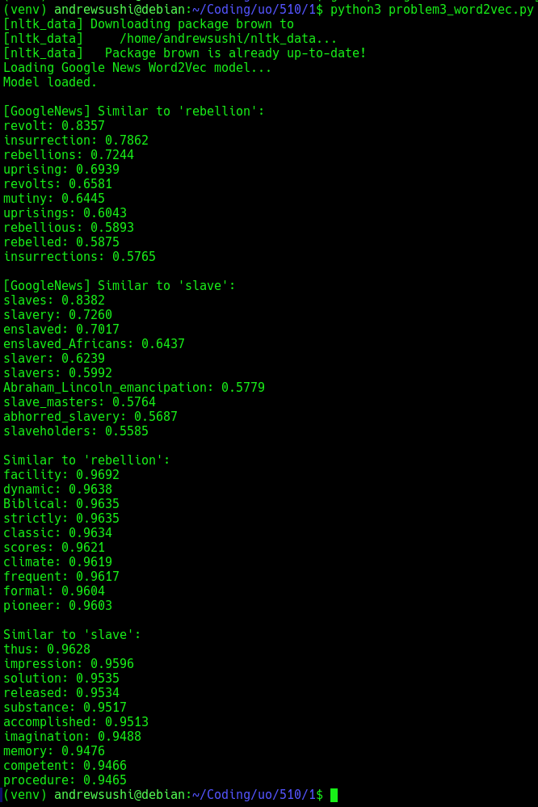

# Assignment 1 - Andrew Chan 
## Problem 1: Document Similarity  

Documents:
- D1 = `[woof woof meow]`  
- D2 = `[woof woof squeak]`  

(a) Cosine similarity using TF weighting  

Vocabulary:  
```
["woof", "meow", "squeak"]
```

Term Frequency Vectors:
- D1 = `[2, 1, 0]`  → woof=2, meow=1, squeak=0  
- D2 = `[2, 0, 1]`  → woof=2, meow=0, squeak=1  

Dot Product:  
```
(2 * 2) + (1 * 0) + (0 * 1) = 4
```

Norms:  
```
||D1|| = sqrt(2^2 + 1^2 + 0^2) = sqrt(5)  
||D2|| = sqrt(2^2 + 0^2 + 1^2) = sqrt(5)
```

Cosine Similarity:  
```
cosine = 4 / (sqrt(5) * sqrt(5)) = 4 / 5 = 0.8
```

Answer (a): `0.8`

---

### (b) Cosine similarity using TF-IDF weighting (2 documents)

IDF values with 2 documents (N=2):  
- `idf(woof) = log₂(2/2) = 0`
- `idf(meow) = log₂(2/1) ≈ 1`
- `idf(squeak) = log₂(2/1) ≈ 1`

TF-IDF Vectors:  
- D1 = `[0, 1, 0]`
- D2 = `[0, 0, 1]`

Dot Product:  
```
(0 * 0) + (1 * 0) + (0 * 1) = 0
```

Norms:  
```
||D1|| = 1  
||D2|| = 1
```

Cosine Similarity:  
```
cosine = 0 / (1 * 1) = 0
```

Answer (b): `0`

---

### (c) Adding third document D3 = [meow squeak]

New document collection:  
- D1 = `[woof woof meow]`  
- D2 = `[woof woof squeak]`  
- D3 = `[meow squeak]`  
Total documents (N = 3)

IDF values with 3 documents:
- `idf(woof) = log₂(3/2) ≈ 0.58496`
- `idf(meow) = log₂(3/2) ≈ 0.58496`
- `idf(squeak) = log₂(3/2) ≈ 0.58496`

TF-IDF Vectors:
- D1 = `[2×0.58496, 1×0.58496, 0]` = `[1.16992, 0.58496, 0]`  
- D2 = `[2×0.58496, 0, 1×0.58496]` = `[1.16992, 0, 0.58496]`


Dot product:  
$$
1.16992 × 1.16992 = 1.3688
$$

Norms:  
$$
\|D1\| = \|D2\| = \sqrt{1.16992^2 + 0.58496^2} = \sqrt{1.3688 + 0.3424} ≈ \sqrt{1.7112} ≈ 1.307
$$

Cosine similarity:  
$$
\frac{1.3688}{1.307 \cdot 1.307} = \frac{1.3688}{1.7112} ≈ 0.8
$$

Answer (c): `0.8`  
Adding D3 caused all of the terms to appear in 2/3 documents. This makes the IDF values equal. Therefore, the cosine similarity is back to the TF case.

## Problem 2: Naive Bayes and smoothing
#### 4.1:
Likelihood table:

| Word     | P(word \| pos) | P(word \| neg) |
|----------|----------------|----------------|
| I        | 0.09           | 0.16           |
| always   | 0.07           | 0.06           |
| like     | 0.29           | 0.06           |
| foreign  | 0.04           | 0.15           |
| films    | 0.08           | 0.11           |

Sentence to classify:  
`I always like foreign films`

Assumption:  
Equal priors:  
$$
P(\text{pos}) = P(\text{neg}) = 0.5
$$

Compute posterior for the `positive` class
$$
P(\text{pos} | \text{sentence}) \propto P(\text{pos}) \cdot P(I|\text{pos}) \cdot P(always|\text{pos}) \cdot P(like|\text{pos}) \cdot P(foreign|\text{pos}) \cdot P(films|\text{pos})
$$

$$
= 0.5 \cdot 0.09 \cdot 0.07 \cdot 0.29 \cdot 0.04 \cdot 0.08
$$

$$
= 0.5 \cdot (5.8368 \times 10^{-6}) = 2.9184 \times 10^{-6}
$$


Compute posterior for the `negative` class

$$
P(\text{neg} | \text{sentence}) \propto 0.5 \cdot 0.16 \cdot 0.06 \cdot 0.06 \cdot 0.15 \cdot 0.11
$$

$$
= 0.5 \cdot (9.504 \times 10^{-6}) = 4.752 \times 10^{-6}
$$

$$
P(\text{neg} | \text{sentence}) > P(\text{pos} | \text{sentence})
$$

Therefore, Naive Bayes says that the class is negative

#### 4.2:
We are given a set of movie reviews labeled as either comedy or action, and we are asked to classify a new document using a multinomial Naive Bayes classifier with add-1 (Laplace) smoothing.

Training Data:
| Review | Words                                 | Class   |
|--------|----------------------------------------|----------|
| 1      | fun, couple, love, love                | comedy   |
| 2      | fast, furious, shoot                   | action   |
| 3      | couple, fly, fast, fun, fun            | comedy   |
| 4      | furious, shoot, shoot                  | action   |
| 5      | fly, fast, shoot, love                 | action   |

Test Document:
```
D = [fast, couple, shoot, fly]
```

Prior Probabilities
- Total documents: 5  
- Comedy: 2 → P(comedy) = 2/5 = 0.4  
- Action: 3 → P(action) = 3/5 = 0.6

Vocabulary
All unique words in the training set:

```
[fun, couple, love, fast, furious, shoot, fly]
```

Vocabulary size: V = 7

Word Counts by Class
Comedy documents (1 and 3):
- Words:  
  fun (3), couple (2), love (2), fly (1), fast (1)  
- Total words:  
  N_comedy = 3 + 2 + 2 + 1 + 1 = 9

Action documents (2, 4, 5):
- Words:  
  fast (2), furious (2), shoot (4), fly (1), love (1)  
- Total words:  
  N_action = 2 + 2 + 4 + 1 + 1 = 10

Likelihoods with Add-1 Smoothing
Using the formula:  
$$
P(w_i | \text{class}) = \frac{\text{count}(w_i, \text{class}) + 1}{N_{\text{class}} + V}
$$

Comedy Class:

| Word   | Count | Smoothed Likelihood |
|--------|--------|---------------------|
| fast   | 1      | (1+1)/(9+7) = 2/16 = 0.125 |
| couple | 2      | (2+1)/(9+7) = 3/16 = 0.1875 |
| shoot  | 0      | (0+1)/(9+7) = 1/16 = 0.0625 |
| fly    | 1      | (1+1)/(9+7) = 2/16 = 0.125 |

Posterior:

$$
P(\text{comedy} | D) \propto 0.4 \cdot 0.125 \cdot 0.1875 \cdot 0.0625 \cdot 0.125 = 0.0000732422
$$

Action Class:

| Word   | Count | Smoothed Likelihood |
|--------|--------|---------------------|
| fast   | 2      | (2+1)/(10+7) = 3/17 ≈ 0.1765 |
| couple | 0      | (0+1)/(10+7) = 1/17 ≈ 0.0588 |
| shoot  | 4      | (4+1)/(10+7) = 5/17 ≈ 0.2941 |
| fly    | 1      | (1+1)/(10+7) = 2/17 ≈ 0.1176 |

Posterior:

$$
P(\text{action} | D) \propto 0.6 \cdot 0.1765 \cdot 0.0588 \cdot 0.2941 \cdot 0.1176 ≈ 0.00021755
$$


Final Decision:
$$
P(\text{action} | D) > P(\text{comedy} | D)
$$

The classifier assigns the label: action

## Problem 3: Word2Vec with gensim and nltk

Train Word2Vec on the Brown Corpus

First I trained a Word2Vec model using the Brown corpus available in nltk python. The model was configured with the parameters:
vector_size = 100
window = 5
min_count = 2
sg = 0

The Brown corpus tokenized as a list of sentences using brown.sents(). Then, the model was saved using model_brown.save(...).

Most Similar Words from Brown Word2Vec:

Next I queried the model for the 10 most similar words to "rebellion" and "slave":

Output of the Brown-Trained Model:

Similar to "rebellion":
```
facility: 0.9692  
dynamic: 0.9638  
Biblical: 0.9636  
strictly: 0.9635  
classic: 0.9634  
scores: 0.9621  
climate: 0.9619  
frequent: 0.9618  
formal: 0.9604  
pioneer: 0.9603
```

Similar to "slave":
```
thus: 0.9629  
impression: 0.9596  
solution: 0.9535  
released: 0.9534  
substance: 0.9517  
accomplished: 0.9511  
imagination: 0.9488  
memory: 0.9476  
competent: 0.9466  
procedure: 0.9465
```

These results were generally more on the abstract side, formal, or loosely related, which shows us the limitations of the smaller and older Brown corpus. Also we can manually look at it and can tell that slave isn't similar to words like solution and prodedure.

---

Pre-trained Google News Word2Vec (300d):

Then we moved onto and also loaded the pre-trained GoogleNews-vectors-negative300.bin using KeyedVectors.load_word2vec_format(...).

This model has been trained on around 100 billion words of news text.

Most Similar Words from Google News Word2Vec

Here was the output of the Google Pre-trained Model:

Similar to "rebellion":
```
revolt: 0.8357  
insurrection: 0.7862  
rebellions: 0.7244  
uprising: 0.6939  
revolts: 0.6581  
mutiny: 0.6445  
uprisings: 0.6043  
rebellious: 0.5893  
rebelled: 0.5875  
insurrections: 0.5765
```

Similar to "slave":
```
slaves: 0.8382  
slavery: 0.7260  
enslaved: 0.7017  
enslaved_Africans: 0.6437  
slaver: 0.6239  
slavers: 0.5902  
Abraham_Lincoln_emancipation: 0.5779  
slave_masters: 0.5764  
abhorred_slavery: 0.5687  
slaveholders: 0.5585
```

These results are a lot better and show semantically relevant vocab with direct connections to history, politics, and social systems. As fitting words similar to slave like slaves, slavery, and enslaved.

Final Comparison and Analysis:

The Word2Vec model trained on the Brown corpus produced loosely related or abstract words and also even wrong and insensitive words. This makes sense since the corpus is small (around 1 million words) and outdated (around 1960s). Words like "rebellion" and "slave" occurred rarely which limits the model's semantic capacity and accuracy.
However, the Google News pre-trained model which was trained on 100B words, was a lot better at returning relevant terms. It cleary capturted the deeper semantic and topical associations such as "mutiny", "insurrection", "slavery", and "slaveholders".

In conclusion, pre-trained Word2Vec embeddings from large modern corpora are a lot better and more effective for capturing true semantic similarity compared to the smaller, general-purpose datasets such as Brown. However, having custom models can still be valuable for domain-specific learnings or applications with contraints.

Here is an image run through my terminal:  
